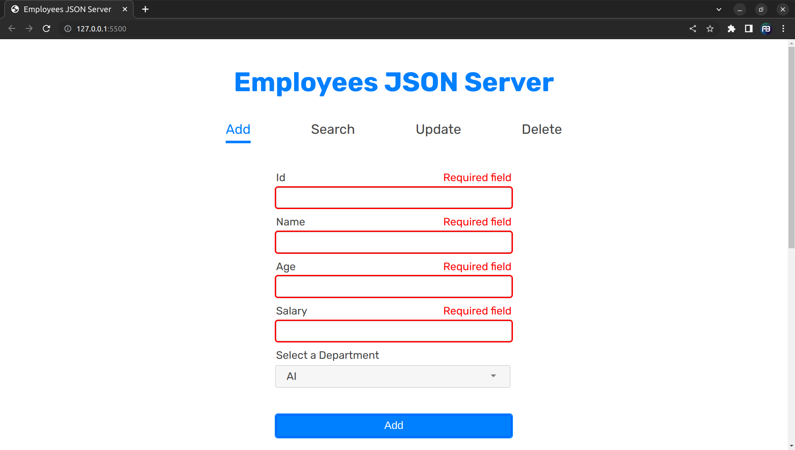
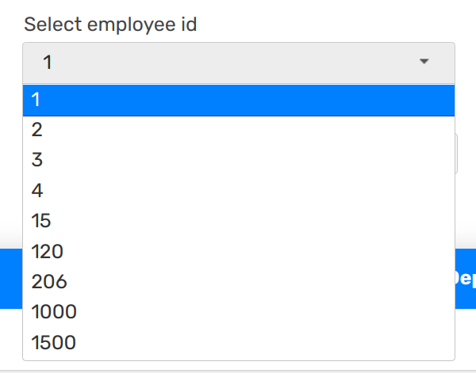

# Employees JSON Server

An Employee management system that supports CRUD operations developed using [JQuery](https://jquery.com/) and [JSON Server](https://github.com/typicode/json-server).


## Table of Contents  
[Dependencies](#dependencies)  
[Usage](#usage)  
[Walkthrough](#walkthrough)  
[Add Employees](#add-employees)  
[Search for Employees](#search-for-employees)  
[Update Employees](#update-employees)  
[Delete Employees](#delete-employees)

## Dependencies

* [JQuery](https://jquery.com/) 
* [Node JS](https://nodejs.org/)
* [JSON Server](https://github.com/typicode/json-server)

## Usage

* In command-line run the following snippet to start json-server

```
npm run JsonServer
```

## Walkthrough

The project uses **json-server** to support basic CRUD operations including:
* Adding new employees.
* Searching for employees by their names.
* Updating employees data (selective fields).
* Removing employees from database.
* In add and edit sections the user must enter valid data according to each field.

JQuery is used to:
* Add nice animations.
* Use `ajax` to make requests to database.

## Add Employees

User can add new employees to database with necessary validations.


* Validations are applied on keyup and focusout events.
* Add button has an click event that will validate input fields before adding a new employee.




### Id Validation

* Id input field cannot be empty
* Id number must be unique
* Only Numbers are allowed
* Negative Numbers are not allowed

<p align="center" width="100%">
     
</p>

### Name Validation

* Name input field cannot be empty
* Only characters and spaces are allowed
* Must be at least 3 letters

<p align="center" width="100%">
     
</p>


### Age Validation

* Age input field cannot be empty
* Only Numbers are allowed
* Age must be between 20 and 60

<p align="center" width="100%">
     
</p>

### Salary Validation

* Salary input field cannot be empty
* Only Numbers are allowed
* Negative Numbers are not allowed

<p align="center" width="100%">
     
</p>

### Department select menu

* There are 3 departments: AI, OS and PD.

<p align="center" width="100%">
     
</p>

## Search for Employees

* Search for employees by their names
* Regular expression is used to filter employees.
* After each key press, a get request is sent to the database.


 
## Update Employees


Steps to update employee's data:
1. Select the id of employee to update his/her data.
2. Select fields of data to be modified.
3. Enter data then press update.


* After updating data:
  
<p align="center" width="100%">
     
</p>

* **Note**: Id selection menu will be updated automatically whenever the user adds or removes an employee.

<p align="center" width="100%">
     
</p>

## Delete Employees


* In delete section, each table record will be assigned to a click event to enable user to select employees.


  
* After selecting employees and clicking on delete button, a confirmation message will pop up.


* After confirmation, selected users will be removed from the database.


* When navigating to other sections, click event will be removed from table records.